# Flow Diagram - 流程图绘制专家

使用 Mermaid 语法快速生成各类图表。

## 支持的图表类型

1. **流程图 (Flowchart)** - 业务流程、决策流程
2. **序列图 (Sequence Diagram)** - 交互时序
3. **类图 (Class Diagram)** - UML 类结构
4. **状态图 (State Diagram)** - 状态机
5. **ER 图 (Entity-Relationship)** - 数据库设计
6. **甘特图 (Gantt Chart)** - 项目进度
7. **思维导图 (Mindmap)** - 脑图
8. **Pie 饼图** - 比例分布

## 触发场景

- "画个流程图"
- "帮我画一个 XXX 流程图"
- "生成序列图"
- "做个思维导图"
- "画个时序图"

## 使用方式

### 方式 1：命令行自动生成（推荐 ✅）

```bash
# 生成登录流程图
python3 ~/.openclaw/workspace/skills/flow-diagram/scripts/auto_diagram.py login

# 生成订单流程图
python3 ~/.openclaw/workspace/skills/flow-diagram/scripts/auto_diagram.py order

# 生成微服务架构图
python3 ~/.openclaw/workspace/skills/flow-diagram/scripts/auto_diagram.py microservice

# 生成序列图
python3 ~/.openclaw/workspace/skills/flow-diagram/scripts/auto_diagram.py sequence

# 生成 SVG 格式
python3 ~/.openclaw/workspace/skills/flow-diagram/scripts/auto_diagram.py login svg
```

### 方式 2：描述需求，自动生成

直接描述你想要什么图：
- "帮我画一个用户登录的流程图"
- "生成订单处理的全流程"
- "画一个微服务架构图"

### 方式 2：Mermaid 语法预览

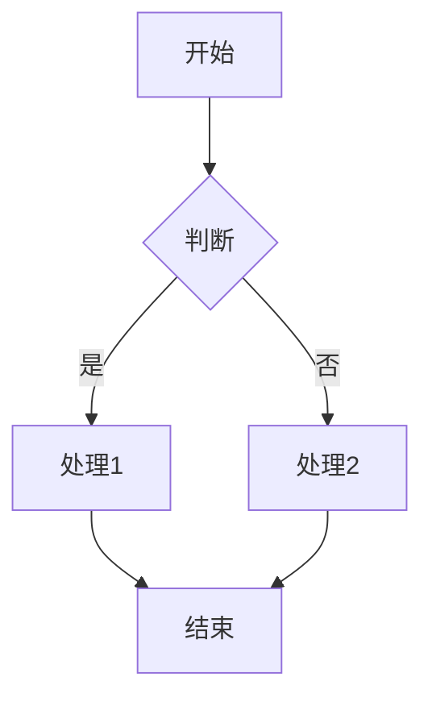

### 方式 3：命令行生成图片

```bash
# 安装 Mermaid CLI
npm install -g @mermaid-js/mermaid-cli

# 生成 PNG 图片
mmdc -i input.mmd -o output.png

# 生成 SVG
mmdc -i input.mmd -o output.svg
```

## 配色方案（让流程图更美观）

### 基础配置（推荐使用）

```mermaid
%%{init: {'theme': 'base', 'themeVariables': { 
  'background': '#ffffff',
  'primaryColor': '#e3f2fd',
  'lineColor': '#333333',
  'fontFamily': 'Microsoft YaHei, sans-serif'
}}}%%
```

### 节点颜色分类

| 类型 | 颜色代码 | 用途 |
|------|----------|------|
| 开始/结束 | `#ff7043` | 起点和终点节点 |
| 准备阶段 | `#fff9c4` | 准备类节点 |
| 执行阶段 | `#ffcc80` | 加工、处理节点 |
| 关键操作 | `#ef5350` | 重要步骤 |
| 完成/成功 | `#66bb6a` | 成功、完成状态 |

### 配色代码参考

**暖色调：**
- 红色系: `#ef5350`, `#e53935`, `#d32f2f`
- 橙色系: `#ff7043`, `#ff9800`, `#f57c00`
- 黄色系: `#fff9c4`, `#ffeb3b`, `#fbc02d`

**冷色调：**
- 蓝色系: `#e3f2fd`, `#90caf9`, `#42a5f5`
- 绿色系: `#e8f5e9`, `#66bb6a`, `#43a047`
- 紫色系: `#f3e5f5`, `#ce93d8`, `#ab47bc`

### 节点样式示例

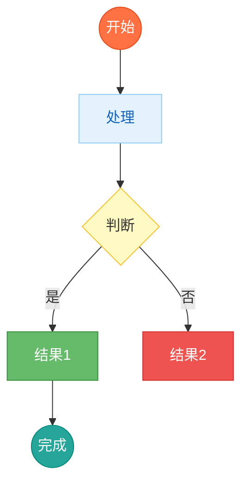

### 流程图

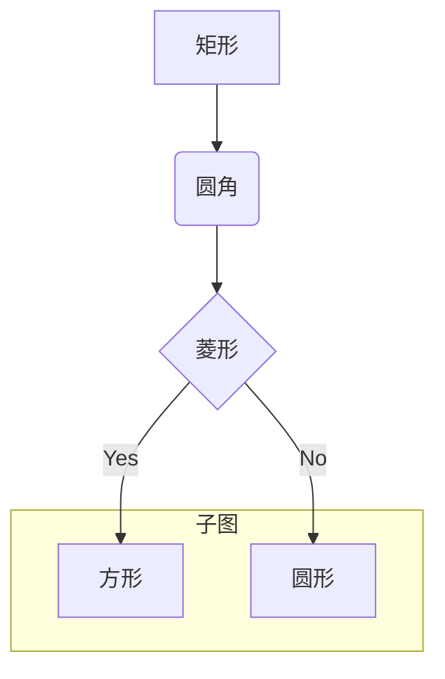

### 序列图

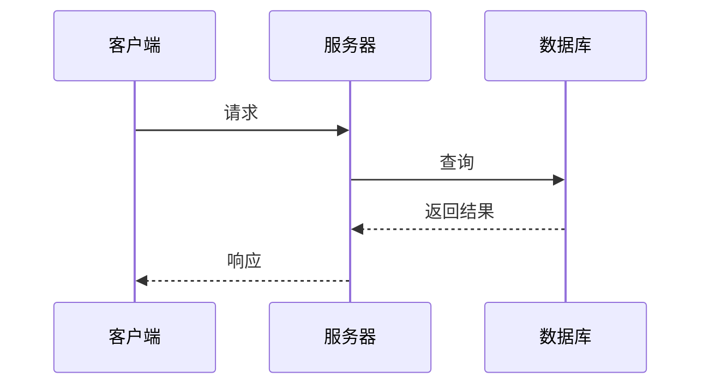

### 思维导图

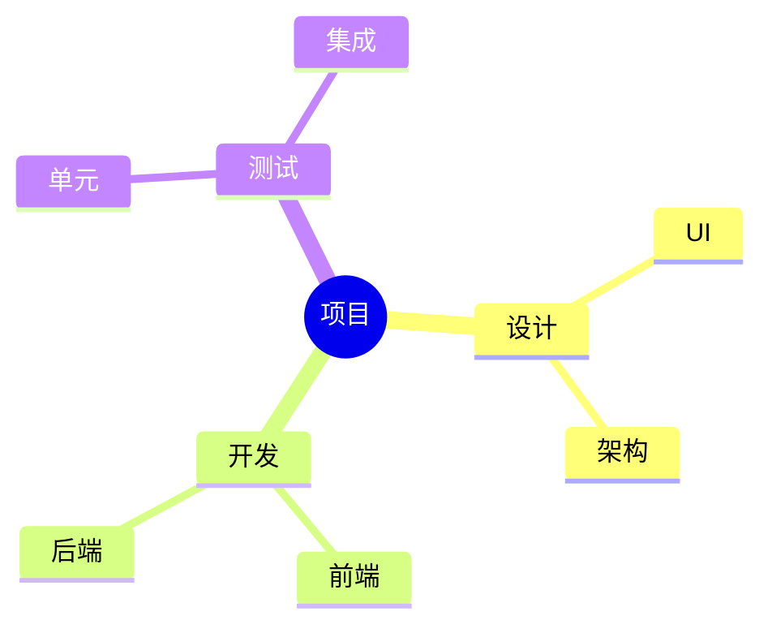

### 甘特图

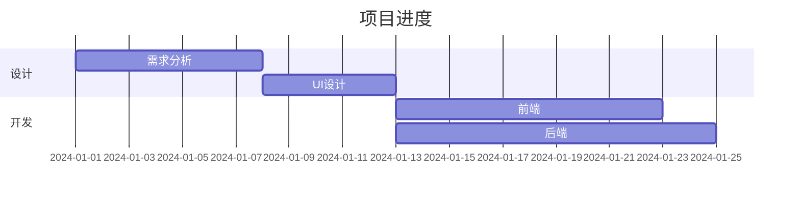

### 类图

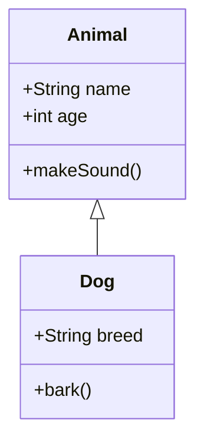

### ER 图

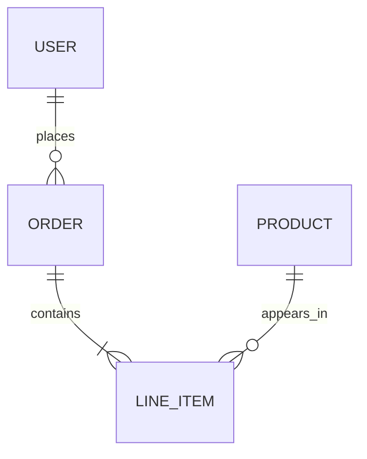

## 快速生成示例

### 用户登录流程

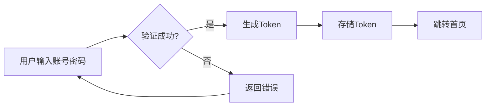

### 订单处理流程

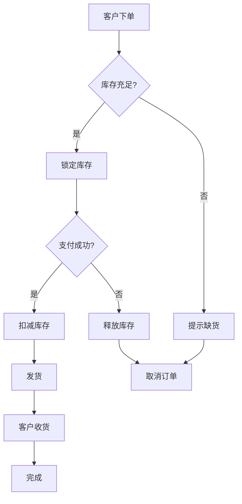

### 微服务架构

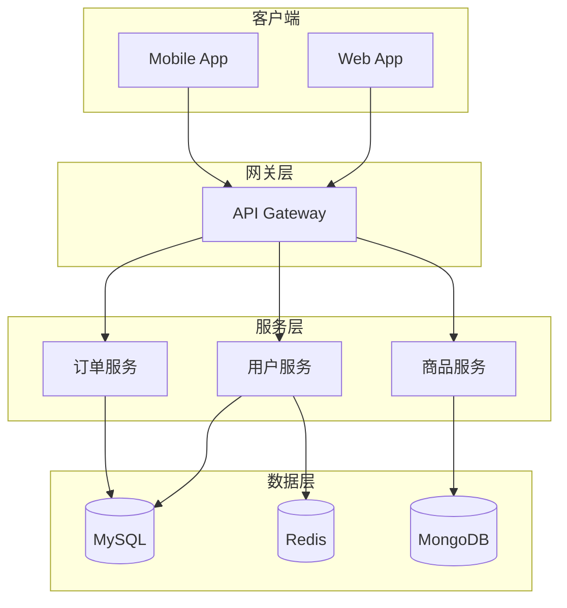

## 在线预览工具

- Mermaid Live: https://mermaid.live/ (可导出 PNG/SVG/PDF)
- Draw.io: https://draw.io (可导出 PDF/PPT)
- PlantUML: https://plantuml.com

## 导出 PDF/PPT 方法

### 方法 1：Mermaid Live（推荐）

1. 打开 https://mermaid.live/
2. 粘贴 Mermaid 代码
3. 点击导出 → 选择格式（PNG/SVG/PDF）

### 方法 2：Draw.io

1. 打开 https://draw.io/
2. 选择 "Presentation" 模式
3. 手动创建或导入图表
4. 文件 → 导出 → PDF/PPT

### 方法 3：本地命令行（需要安装）

```bash
# 安装 Node.js 后
npm install -g @mermaid-js/mermaid-cli

# 生成 PNG
mmdc -i diagram.mmd -o diagram.png

# 生成 SVG
mmdc -i diagram.mmd -o diagram.svg
```

### 方法 4：Python 脚本生成 PPT

需要安装 python-pptx：
```bash
pip install python-pptx
```

## 技巧

1. 使用 `subgraph` 组织复杂流程
2. 用不同形状表达不同含义：`[]` 矩形、`()` 圆角、`{}` 菱形
3. 序列图用 `-->` 表示虚线，`->>` 表示实线
4. 用 `|标签|` 给分支加说明
5. 注释用 `%%`

## 输出格式

当用户需要图表时：
1. 先用 Mermaid 语法生成代码
2. 提供在线预览链接
3. 如需要图片，提供命令行转换方法
